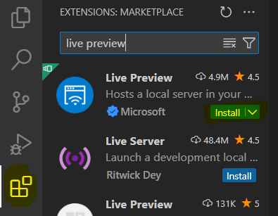

# 1.4 - The WWW (World Wide Web)

###### ICS3U Front End Dev - Mr. Jamieson 🐠

## 🚧 Your Task

1. Right now the [`index.html`](index.html) file is empty. Construct a proper HTML document by including the required `DOCTYPE`, `HEAD`, and `BODY`. Utilize the proper formatting and setup described in [the lesson](README.md).

2. Browser tabs usually display a title of the page being displayed. This is done using [the title tag](https://www.w3schools.com/html/html_head.asp) _inside_ the `<head>` tag.
    1. Research [the title tag](https://www.w3schools.com/html/html_head.asp) and add one to your page
    2. Make your title say "1.4 - The World Wide Web"
    3. Check that it worked by previewing your page in an _external browser_ as demonstrated in class

3. Commit your code and synchronize it back to GitHub.

 

### Reminder:

Make sure you have the **Live Preview** extension in your VSCode environment
- Go to the Extensions panel (icon that looks like four squares)
- Search for "Live Preview"
- Install the extension called "Live Preview", authored by Microsoft
